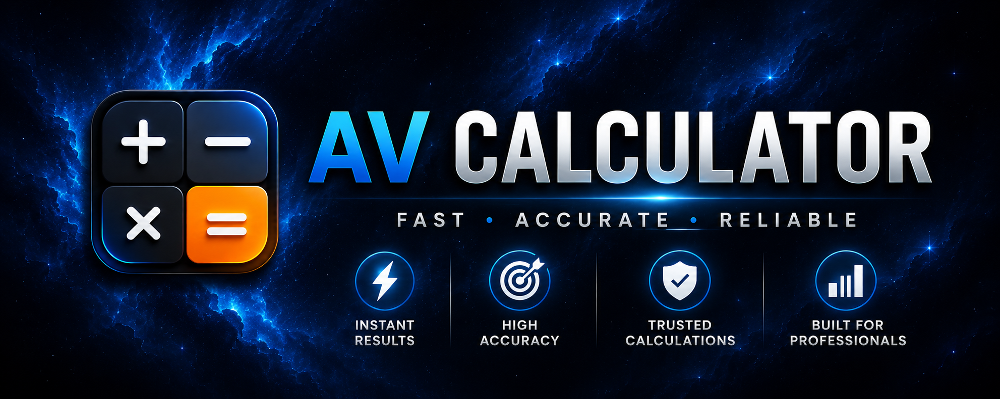

# 🧮 AV Calculator

### Powerful • Fast • Modern Android Calculator

A feature-rich calculator app combining scientific calculations, unit conversions, and financial tools in one place.

📱 About

AV Calculator is a modern, lightweight, and feature-rich calculator application that combines advanced mathematical tools, converters, and financial calculators into a single app.

---

✨ Features

🔢 Basic Calculator

- Addition (+)
- Subtraction (−)
- Multiplication (×)
- Division (÷)
- Percentage (%)
- Decimal Calculations

🧪 Scientific Calculator

- Trigonometric Functions
- Logarithms
- Powers & Exponents
- Square Root & Cube Root
- Factorial
- π and e Constants

📏 Unit Converter

- Length
- Weight
- Area
- Volume
- Temperature
- Speed
- Time
- Data Storage

💱 Currency Converter

- Real-Time Currency Conversion
- Supports Major World Currencies

🎂 Age Calculator

- Exact Age Calculation
- Date Difference Calculator

💰 Financial Tools

- EMI Calculator
- GST Calculator
- Discount Calculator
- Mortgage Calculator
- Tip Calculator

⚖ Health & Utility

- BMI Calculator
- Fuel Calculator
- Split Bill Calculator

🎨 User Experience

- Material Design UI
- Dark Mode Support
- Calculation History
- One-Tap Result Copy
- Lightweight & Fast
- Smooth Performance

---

📊 Application Information

Property| Value
App Name| AV Calculator
Package Name| "av.calculator.pro"
Developer| Vaibhav

---

🚀 Installation

1. Download the APK.
2. Install it on your Android device.
3. Open AV Calculator.
4. Start calculating.

---

🤝 Contributing

Contributions, bug reports, feature requests, and suggestions are welcome.

Feel free to fork the repository and submit a Pull Request.

---

👨‍💻 Developer

Vaibhav

Telegram: https://t.me/BlackDex

---

⭐ If you like this project, consider giving it a star!

Made with ❤️ by Vaibhav

